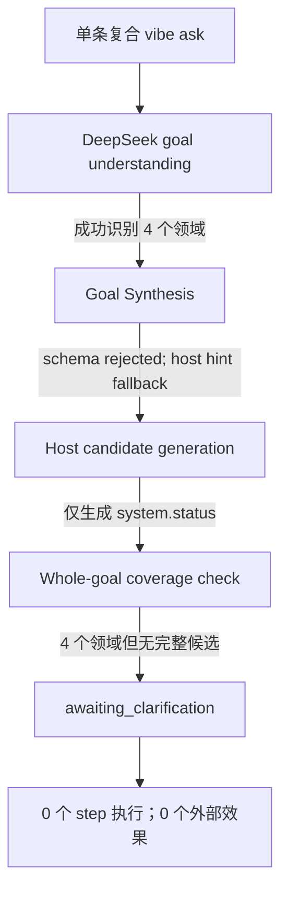

# 多领域复合任务阻断问题评估报告

- 日期：2026-07-31
- 代码基线：`e3bacd88f053a7dcef05c42c0ed0c9b388f07c92`
- 复现环境：Fedora GNOME VMware，部署目录 `/home/rand0mg/vibeos-e3bacd8`
- 复现入口：普通在线 `vibe ask`，未使用 `--offline` 或 `--dry-run`
- 结论状态：问题已定位；2026-08-01 路线图责任边界已批准并写入 Goal 05/06/08，代码修复尚未实现

## 技术结论

本次失败不是 provider credential、Secret Service 权限、DeepSeek API 连通性或 GitHub
网络造成的。普通 `vibe ask` 已经通过 Model Gateway 真实调用
`deepseek-v4-pro`，模型也正确识别出 `system_observation`、`browser`、`clipboard` 和
`notification` 四个领域。任务在产生任何外部效果之前，被 host-owned candidate
selector 按当前安全规则转入 `awaiting_clarification`。

直接原因是当前 planning pipeline 只能为该请求生成一个只覆盖 `system.status` 的候选，
而 selector 明确拒绝把多领域目标缩减成单领域动作。这一 fail-closed 行为本身是正确的；
真正缺失的是“完整目标覆盖的多步骤计划”能力。

该问题不应重新定性为 Goal 04 的 Gateway 失败，也不应被解释为用户权限不足。它是：

1. **Goal 05 的模型合同和诊断缺口**：purpose-specific schema、schema rejection、
   response digest 与 fallback provenance 尚未闭环；
2. **新 Goal 06 的复合目标规划缺口**：subgoal/source-span 覆盖、whole-goal candidate、
   条件、typed data binding 和完整覆盖门禁尚未实现；
3. **Goal 08 的真实 GNOME 验收缺口**：即使 Goal 06 能生成完整计划，真实浏览器、
   剪贴板、通知及其独立完成证据仍须在 Goal 08 的桌面环境中验收；
4. **原路线图合同缺口已修订**：复合 planner 不再隐含塞入 Goal 05；它被拆成独立
   Goal 06，原 Goal 06–11 顺延为 Goal 07–12。

建议严重性定为 **P1 功能/路线图缺口**：它不会越权执行或泄漏秘密，但会阻断用户认为
最基本的 Agent 能力——把一个有条件、有顺序的自然语言目标转换成完整任务并执行。

## 复现场景与观察结果

复现请求为：

> 检查当前系统和 VibeOS 服务状态。如果运行正常，打开项目的 GitHub 页面，把包含检查
> 时间和状态的摘要复制到剪贴板，并发送“VibeOS 发布前检查完成”的桌面通知。

VM 返回的关键事实如下：

| 检查点 | 观察结果 | 判定 |
| --- | --- | --- |
| CLI 入口 | 普通在线 `vibe ask` 正常进入任务系统 | 通过 |
| Provider | `analysis_provider_name=deepseek`，`analysis_model_name=deepseek-v4-pro` | 真实 API 通路通过 |
| 目标理解 | 正确识别四个领域，置信度 `0.9` | 通过 |
| Goal Synthesis | `parse_valid=false`，`fallback_used=true`，错误为 `goal synthesis status is invalid` | 降级 |
| Candidate generation | 只生成 `system_status_route`，仅含一个 `system.status` step | 目标覆盖不完整 |
| Candidate selection | 返回 `action=clarify`，拒绝多领域部分计划 | 安全阻断 |
| Durable task | `status=awaiting_clarification`，`completed_step_ids=[]` | 未执行 |
| GitHub 网络 | 尚未进入浏览器步骤 | 未测试，不是本次直接原因 |
| 权限/Secret Service | Provider 调用已经成功，且无 capability dispatch | 不是本次直接原因 |

任务 `task_5d1861f3c7a56f35e9fe` 的 deadline 已经过期，不应继续恢复；修复后应创建新任务
重新验收。

## 失败发生在规划边界，而不是执行边界

这条链说明两个不同层次的问题：

- **Goal Synthesis 降级不是最终阻断点。** 即使 host hint 回退给出了 `status=ready` 和四个
  candidate domains，host candidate generation 仍只构造了 `system.status` 候选。
- **最终阻断是显式安全规则。** [`candidate_selection.py`](../../src/vibeos/candidate_selection.py#L137-L151)
  对任何多领域 understanding 直接返回 `clarify`，避免选择只覆盖部分目标的候选。
  对应回归测试 [`test_candidate_selection_safety.py`](../../tests/test_candidate_selection_safety.py)
  也明确把该行为固定为当前安全合同。

因此不能通过删除多领域 guard 来“修复”。如果直接放开 selector，系统会只检查状态，
却可能把整个发布前检查谎报为完成，严重性高于当前安全阻断。

## Goal Synthesis 还存在独立的可诊断性缺陷

请求载荷已经向模型声明四个合法状态：`ready`、`clarification_needed`、
`missing_capability`、`unsupported`；校验器也会拒绝其他值，见
[`goal_synthesizer.py`](../../src/vibeos/goal_synthesizer.py#L337-L383)。真实响应触发了
`goal synthesis status is invalid`，说明 provider 返回对象没有满足该合同。

当前异常路径随后调用 `_host_hint_fallback()`，并把 `_last_raw_output` 改写为 fallback
payload，见 [`goal_synthesizer.py`](../../src/vibeos/goal_synthesizer.py#L59-L90)。因此 VM
输出同时出现了：

- `normalized_output.status=ready`；
- `parse_valid=false`；
- `error=goal synthesis status is invalid`；
- `raw_output` 却是已经回退后的 host hint。

这不是“`ready` 被错误判为非法”的直接证据；更可能是实际 provider payload 中的 status
非法，而原始失败证据在回退时被覆盖。现有输出不足以还原模型究竟返回了什么。Goal 05
需要保留脱敏、限长的失败摘要或响应 digest，并把 `schema_rejected` 与 host fallback 明确
区分，不能让 fallback payload 冒充 raw provider output。

## Goal 04、Goal 05、Goal 06 与 Goal 08 的责任边界

| 阶段 | 应承担内容 | 本问题中的状态 |
| --- | --- | --- |
| Goal 04 | 唯一 Gateway v1、SecretRef、隔离 transport、固定 systemd 纵向切片和真实 provider 证明 | API/secret 基础已工作；本次不构成 Gateway 再次失败 |
| Goal 05 | 统一所有生产模型 purpose、strict schema、失败分类、response digest、fallback provenance 和 Secret Broker | 负责模型边界，不实现 whole-goal composer |
| Goal 06 | 有界 subgoal/source-span、host composer、coverage gate、条件、typed binding 和 Durable Task 集成 | 复合规划与安全选择的唯一 owner |
| Goal 07 | 可安装、非 editable runtime 和有限用户态任务 | 不负责重建复合 planner |
| Goal 08 | 固定 GNOME mixed-task、API-first 四领域 smoke、桌面观察、恢复和独立完成证据 | 负责真实执行层，不反向补造模型/Gateway/规划权威 |

Goal 04 明确只要求 `service_diagnosis` 的最小 Gateway 和 systemd 用户服务场景，并把
其余模型调用迁移留给 Goal 05，见
[`04_core_execution_foundation_and_system_service_slice.md`](../goals/agent_native/04_core_execution_foundation_and_system_service_slice.md#L171-L189)。
当前状态文件已经把 multi-domain compound planning 重新归属 Goal 06，
见 [`current_status.md`](current_status.md#L170-L180)。

Goal 05 现在要求 planning purpose 的 strict schema、真实 rejection metadata 和明确
handoff，但明确不实现 whole-goal composer，见
[`05_model_gateway_and_secret_broker.md`](../goals/agent_native/05_model_gateway_and_secret_broker.md)。
完整功能门禁由新的
[`06_bounded_compound_goal_planning.md`](../goals/agent_native/06_bounded_compound_goal_planning.md)
承担，因此文件名、owner 与可验收交付物一致。

Goal 08 保留原跨系统服务和桌面应用的 AT-SPI/portal 黄金场景，并新增一个不依赖公网的
四领域 API-first smoke，见
[`08_gnome_mixed_task_mvp.md`](../goals/agent_native/08_gnome_mixed_task_mvp.md)。因此 Goal 06
交付可验证的完整计划与安全恢复语义，Goal 08 再用真实 GNOME adapter 执行并验证，
两个阶段都不得新建第二套 planner。

## 已批准的路线图修订

批准采用“**Goal 05 交付模型 schema/诊断 handoff，Goal 06 交付最小 whole-goal
planning contract，Goal 08 交付真实桌面执行**”的切分方式。

### Goal 05 应实施的模型边界

1. 为 `goal_understanding`、`goal_synthesis`、`route_selection` 等 purpose 定义独立 strict
   schema；schema rejection 必须返回分类错误和脱敏证据，不得被 caller 的通用 JSON
   fallback 模糊化。
2. schema failure 保留脱敏错误类别、provider/model/purpose、response digest 和 fallback
   provenance；fallback 内容不得冒充 raw provider output。
3. 为 Goal 06 提供版本化、受 host capability boundary 限制的 subgoal proposal handoff；
   Goal 05 结束前多领域执行仍 fail-closed。

### Goal 06 应实施的复合规划

1. 将一个复合 utterance 分解为有独立 source span 的 bounded subgoals，保留条件、顺序、
   数据依赖和原文 provenance。
2. host 必须验证 candidate plan 对全部 required subgoals/capabilities 的覆盖。只有完整
   覆盖才能进入选择和执行；部分覆盖必须在任何 effect 前 fail-closed。
3. selector 不再按 `len(domains) > 1` 一律澄清；当且仅当存在经过 whole-goal coverage
   校验的候选时才可选择，否则继续澄清或返回明确 unsupported。
4. 多步骤计划继续使用现有 Durable Task Engine、Effect Policy、deadline、idempotency、
   receipt 和 verifier 权威，不创建 provider 私有 task loop。
5. 首期限制为 4 domain、8 executable step、E0/E1、无环 DAG、一层 `when` 条件和
   allowlisted typed binding；不建设通用工作流平台。
6. 提供 controlled-provider/Durable Task 的复合任务固定证明；Goal 06 不借此扩大到
   任意桌面自动化。

### Goal 06 的核心验收条件

- [ ] 一个固定的两领域和一个固定的四领域请求均生成 source-span 完整、依赖明确的
  whole-goal candidate；不能只生成首个动作。
- [ ] 条件分支“如果服务正常”绑定 `system.status` 的 typed result；条件不成立时，后续
  effect 不执行且任务结果可解释。
- [ ] “包含检查时间和状态的摘要”通过 typed step output/data binding 传给
  `clipboard.write`，不得由执行器猜测或重新调用模型拼接。
- [ ] 任一子目标缺 capability、参数、policy 或 verifier 时，任务在第一个外部 effect
  前澄清/阻断；禁止部分成功后把整体目标标为成功。
- [ ] strict schema 失败保留脱敏错误类别、provider/model/purpose、response digest 和
  fallback 决策；`raw_output` 字段不得被 fallback 内容冒充。
- [ ] 单领域 Goal 03/04 行为、19 capability、effect policy、deadline 和恢复合同无回归。

### Goal 08 应承担的真实环境验收

Goal 08 应在 Fedora GNOME VM 中使用一个不依赖公共互联网的受控任务证明系统状态、
浏览器、剪贴板和通知的真实组合执行。浏览器固定打开 acceptance-owned、task-scoped
loopback fixture，再验证：

1. system status 的真实读取及条件分支；
2. 浏览器实际打开预期 URL，并由独立 browser observation 验证；
3. clipboard 实际写入动态摘要并 readback；
4. GNOME 桌面通知实际出现并留存受控证据；
5. daemon 重启、deadline、用户接管和失败恢复不会重复外部效果。

GitHub 可达性应作为独立环境前提记录。它可以是额外的真实网络 smoke，但不应成为验证
复合规划和本地 GNOME effect 的唯一页面依赖，否则网络阻塞会掩盖 planner 或 adapter
缺陷。

## 修复顺序

1. **先完成 Goal 05**：交付 purpose-specific schema、真实 rejection metadata、
   fallback provenance 和测试。
2. **再执行新 Goal 06**：实现 whole-goal candidate composer，复用现有单领域
   route/step builders，增加
   subgoal coverage、依赖和 typed data binding，不重写 Durable Task Engine。
3. **建立确定性测试矩阵**：覆盖完整计划、部分能力缺失、条件为假、deadline、恢复、
   review 和无部分执行。
4. **Goal 07 扩展用户态能力并交付安装 artifact**，继续复用 Goal 06 规划合同。
5. **最后进入 Goal 08 VM 真实验收**：使用本地可达 fixture 完成混合任务，再把 GitHub
   可达场景作为额外网络证据。

## 不建议的修复方式

- 删除多领域 selector guard，让系统选择 `system.status` 的部分计划；
- 在 CLI 或 shell 中拆成四条命令后把结果冒充为一次 Agent 任务；
- 用 `--offline`、`--dry-run` 或 mock 代替真实 provider/桌面验收；
- 在 Goal 08 新建第二套 planner、模型调用或 Secret Broker；
- 因 GitHub 不可达而把当前失败归类为网络问题；
- 把 provider 返回的宽松 JSON 直接信任为可执行计划。

## 验收判定

在当前代码基线上，这次运行应记录为：

- **真实 DeepSeek 普通调用：通过**；
- **四领域目标识别：通过**；
- **Goal Synthesis strict schema：失败后安全回退，但诊断证据不足**；
- **whole-goal candidate generation：未实现**；
- **部分计划拒绝：通过，符合当前安全合同**；
- **复合任务真实执行：未开始，不能签收**。

只有 Goal 05 的模型合同可诊断、Goal 06 能稳定产生并验证完整复合计划，且 Goal 08 在
真实 GNOME 中完成对应动作与
独立 postcondition evidence 后，才可以声称这类任务端到端可用。

## 评估范围、方法与限制

本报告基于四类证据交叉判断：用户提供并按 UTF-8 读取的 Fedora VM 完整 CLI 输出、上述
代码基线中的 planning/goal-synthesis 实现、当前安全回归测试，以及 Goal 04/05/06/08 的
正式规划与状态文档。本次只分析已经发生的运行，没有再次调用付费 provider、重放过期
任务或执行桌面效果。

以下限制不会改变“阻断发生在规划阶段”的结论，但会影响后续修复细节：

- Goal Synthesis 的原始非法 provider payload 已被 fallback metadata 覆盖，无法从现有
  transcript 判断具体非法 status 值；
- 浏览器、剪贴板和通知没有 dispatch，因此本次运行不能评价这些 adapter 的真实状态；
- GitHub 在目标 VM 中不可达，但执行尚未进入网络步骤，不能用该环境限制解释当前失败；
- 当前报告提出的是阶段边界和验收合同，不代表复合 planner 已经实现或通过测试。

## 2026-08-01 项目经理决议

1. Goal 05 不承担 executable whole-goal planner；新增独立 Goal 06，后续编号顺延到 12。
2. 首版复合计划限制为 4 domain、8 executable step、E0/E1、无环 DAG、一层 `when`
   条件；条件只允许 `eq`、`in`、`exists`，binding 只引用 allowlisted typed field 和
   host-owned formatter。
3. `system.status` 是否正常由 host-owned `HealthPolicy` v1 输出
   `healthy/degraded/unhealthy/unknown`；只有 `healthy` 为真，其他结果不执行后续 E1。
4. Goal 08 使用 acceptance-owned、task-scoped loopback fixture，不建设永久 Core Web
   Server；浏览器、剪贴板、通知分别由既有 observation/readback 路径独立验证。
5. GitHub 网络访问是额外真实网络 smoke，不是本地复合规划或 GNOME effect 的硬门禁；
   无公网时记录 external blocker。
