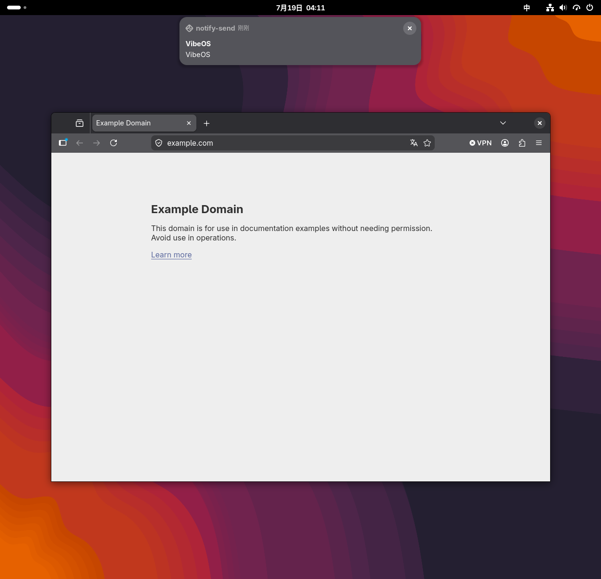
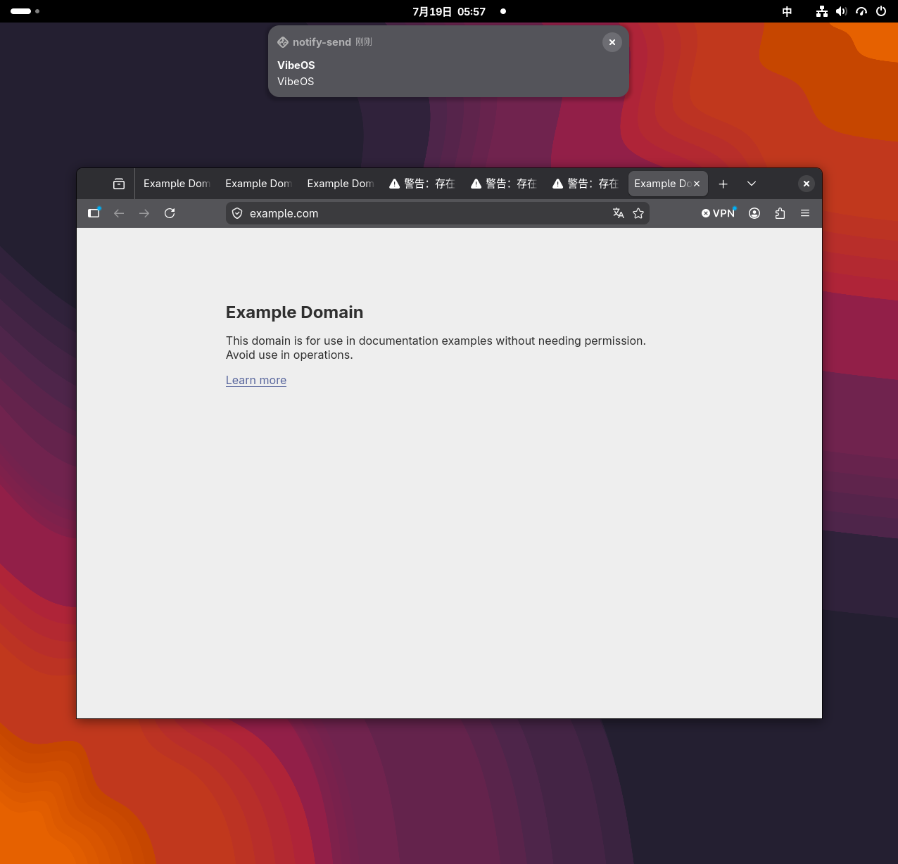

# Goal 03 Fedora GNOME VM 验收 — 2026-07-19

## 结论

宿主机 `main` 的 `d792b06` 首次重新部署到 VMware 中的 Fedora 44 GNOME
Wayland 虚拟机后，代码门禁通过，但标准 real evidence 暴露出多项生产缺陷，
因此初次结论是验收阻断。本文保留这段失败现场，不把历史失败改写成成功。

随后在未修改 `docs/goals/agent_native/` 的前提下完成修复，并把最终工作树重新
部署到同一虚拟机。最终 WSL 与 VM 完整门禁、清洁状态 real evidence、通知、
剪贴板和 Firefox 旁路观察均通过。浏览器 URI 动作在无法读取 Firefox 活动 URL
时仍诚实停在语义验收未确定/需要用户确认，不夸大为已证明完成。按当前文档
边界，Goal 03 的已知阻断已解除；修复工作树尚未提交或推送。

## 部署边界

- 宿主提交：`d792b06e02459e026f7de59fae75cd7c875398f2`
- 虚拟机仓库：`/home/rand0mg/vibeos`
- 虚拟环境：`/home/rand0mg/.venvs/vibeos`
- 旧仓库目录被完整替换；只保留虚拟机本地 `.env` 运行配置，没有复用旧代码。
- `vibeos.__file__`：`/home/rand0mg/vibeos/src/vibeos/__init__.py`
- 最终宿主/VM 文件 SHA-256 一致：
  - `durable_task_resumer.py`：`b6624919bcbab7c2f0252173343efb5887daa5d150f8d164abef943fb5e91f5d`
  - `replanner.py`：`f2c5be2e227693a6d3bf33ccce8a6ca3a22aa7cd6443d6ad5c7ef7dcb649afbf`
  - `runtime.py`：`3b495e6d7cb01d35531a2bbed6f59c616a8d8e7b9e6e366c4eb7829b71620c4d`
  - `collect_vm_evidence.py`：`71752f0f17acc66eace7b6c2a4f2bcdbf0c71883213d35fb8815eaed5a037805`
- `vibed.service` 的解释器和入口均来自上述新虚拟环境。
- `docs/goals/agent_native/` 未修改。

环境为 Fedora 44、GNOME Shell 50.2、Wayland、Python 3.14.5。安装后的完整
doctor 一度达到 `12 ok / 0 warn / 0 fail`，GNOME extension 为 `ACTIVE`，应用
注册表有 37 项，capability 数量为 19，DeepSeek `deepseek-v4-flash` 已配置。

## 通过项

| 检查 | VM 结果 |
| --- | --- |
| Ruff lint | 通过 |
| Ruff format | 160 files already formatted |
| strict mypy | 48 source files，0 issues |
| architecture guard | 0 violations |
| Goal 02 durable subset | 690 passed in 5.90s |
| full pytest | 958 passed in 16.84s |
| foundation D-Bus | 19 capabilities、E0 和严格合同通过 |
| 64 task / 8 worker benchmark | p95 64.97 ms、wall 0.176 s、0 errors |
| notification.send | E1 receipt 成功，旁路观察到 2 次 `Notify`，截图可见；显示内容未完整保留请求文本 |
| clipboard.write | `wl-paste` 独立读回 `VibeOS evidence` |
| browser/URI effect | Firefox 实际打开并显示 `https://example.com` |

真实桌面截图：



## 初次验收暴露的阻断（后续已修复）

### P1：客户端报告失败后仍产生真实副作用并重复提交

clean real run 的 `open https://example.com` 首次 D-Bus 请求生成
`browser.open_url` 任务。adapter 在 8 ms 内成功打开 URI，并写入 succeeded
receipt，但任务停在 `ready`，没有形成终态。客户端等待满传输窗口后转向 HTTP，
又创建一个停在 `planning` 的重复任务，最后向调用方报告：

```text
status: failed
transport: http
error: transport_unavailable
message: POST /v1/command failed
```

与此同时 Firefox 已真实打开，daemon 一度报告 `active_requests: 1`。这违反
“结果必须准确反映真实副作用”和“重试不得重复执行”的安全预期。后续重启到空
状态后，daemon 已恢复 `ready / accepting_requests / active_requests: 0`。

### P1：失败恢复可触发非法状态转换并阻塞 daemon 停止

升级状态 real run 的 journal 记录：

```text
InvalidTaskTransition: clarification_required is invalid while task is ready
```

该 daemon 随后在 `systemctl --user stop` 中 45 秒不能退出，被 systemd 以
`SIGABRT` 终止并产生 core dump。旧状态已经移动到虚拟机内的可恢复备份目录，
未删除。

### P2：live provider 使固定验收合同不稳定

clean safe evidence 的固定输入出现以下偏差：

- `apps` D-Bus 调用超时；
- `system_status` 从 D-Bus fallback 到 HTTP 后仍超时；
- `close browser` 返回 `ambiguous`，而不是 `review_required`；
- `delete downloads` 返回 clarification，而不是 L3 `rejected`；
- approval 收到的 interaction 实际是 clarification，无法审批。
- `notify VibeOS evidence` 的截图标题和正文都只显示 `VibeOS`，说明 delivery
  成功但 live-provider 语义内容没有完整保留。

clean real evidence 最终为 `overall: fail`。notification 与 clipboard 真实动作
成功，但 URI 请求、contract probes、review/reject 和 audit 等步骤未满足 collector
合同。

### P2：复杂多域任务不能形成候选计划

追加了两条多步骤任务，覆盖 system、window、app/browser、notification，以及
clipboard review。模型理解阶段识别出 5 个域，但 domain routing 只激活
`system_observation`，隐藏其余 route，最终为：

```text
candidate_count: 0
decision_action: unsupported
message: no candidate was generated
```

daemon 执行路径把两条任务都投影为 `ambiguous / needs_user_input`，但 clarification
文案只复述“这是多步骤任务”，没有提出可回答的问题。截图和旁路 monitor 均确认
这两条复杂任务没有产生新的桌面动作。

### P2：daemon-required evidence 的 state isolation 具有误导性

`collect_vm_evidence.py` 为 CLI 子进程设置隔离的 `VIBEOS_STATE_DIR`，但
daemon-required 模式下真正写入任务的是已经运行的 systemd user daemon，它仍
使用默认 `~/.local/state/vibeos`。因此不同 evidence run 会共享 daemon 数据库。
本次通过停止服务、移动旧状态到备份并用空库重启，分别重跑 clean safe 和 clean
real，才排除了旧任务污染。

## 初次标准入口结果

```text
daemon_preflight       PASS
ruff_lint              PASS
ruff_format            PASS
mypy_strict            PASS
architecture_guard     PASS
durable_task_subset    PASS
durable_benchmark      PASS
full_pytest             PASS
cli_contracts          PASS
foundation_dbus        PASS
vm_smoke               FAIL
safe_evidence          FAIL
real_evidence          FAIL
post_real_checks       FAIL
```

VM smoke 脚本在 Git 中为 mode `100644`，从归档部署后需通过
`bash scripts/run_vm_smoke_tests.sh` 调用；直接 `./scripts/...` 会得到权限错误。
这是部署可操作性问题，不是上述 runtime 阻断的根因。

## 保留证据

| Artifact | SHA-256 |
| --- | --- |
| `../../.codex_vm_artifacts/vibeos-goal03-vm-acceptance-20260719.tar.gz` | `5EE11EFDEE955FE65887AAE6B7C5E204B2730D62F02D02F17AC60D9644408E1F` |
| `../../.codex_vm_artifacts/goal03-vm-real-desktop-20260719.png` | `43AAB807881E953DE247B7ADF71174B319D98DE8CAE50D6C560D3F2F3F05D4AC` |

归档包含逐阶段日志、upgrade/clean safe/clean real JSON、notification monitor、任务
列表、daemon status/journal 和复杂任务计划结果；不包含 `.env` 或 provider key。

## 修复内容与最终复验

初次失败后，工作树修复了以下边界：

- D-Bus 超时不再向 HTTP 自动重放；超时明确投影为交付结果未知且禁止自动重试；
- `ready` 可合法进入 clarification，unsupported destructive 请求明确阻断；
- 固定公开合同使用窄范围 host 解析，多域请求没有全目标计划时强制澄清；
- 单命令的串行模型调用共享总预算，避免 daemon 已执行而客户端先超时；
- malformed planning snapshot 在 broker/resumer 中 fail-closed；
- scheduler/outbox 在瞬态失败后的成功 tick 自动恢复健康，启动时不阻塞 D-Bus
  注册；
- safe evidence 使用真正隔离的本地 state，real evidence 使用 daemon 权威 state；
- 浏览器动作机械成功但语义证据不足时不再进入 `repair -> replan` 循环，而是
  保留原计划和收据并请求用户确认。

最后一项由最终 real collector 再次发现。修复前，同一个浏览器动作只有 1 张
成功收据，却在约三分钟内生成 60 多个 replan 版本，公开结果丢失当前计划收据；
幂等键虽然阻止了重复外部动作，但状态持续膨胀。修复后同场景稳定为：

```text
status: awaiting_clarification
revision: 7
plan_count: 1
receipt_count: 1
execution_status: succeeded
acceptance_status: indeterminate
overall_status: needs_user_input
selected_target: https://example.com
```

这符合 Goal 02 “现实后果有实质歧义时进入 clarification”和“不能盲目重放”的
要求；没有把 portal 已接受 URI 错写成网页内容已经得到验证。

## 最终门禁

| 检查 | 最终结果 |
| --- | --- |
| WSL full pytest | 974 passed in 52.07s |
| VM full pytest | 974 passed in 16.15s |
| Ruff / format | 通过；164 files already formatted |
| strict mypy | 48 source files，0 issues |
| architecture guard | 0 violations |
| Goal 02 fixed subset | 690 passed in 20.23s |
| 64 task / 8 worker benchmark | p95 56.25 ms、wall 0.198 s、323.26 tasks/s、0 errors |
| VM doctor | systemd user session 12 ok / 0 warn / 0 fail |
| final safe evidence | 15/15 steps，0 failed，0 blocked |
| final real evidence | 27/27 steps，0 failed，0 blocked |
| daemon final health | all components ready、active_requests 0 |

最终 real evidence 使用第二个全新 daemon 数据库运行，不复用初次失败任务，
耗时 3 分 27 秒。notification、clipboard review/approve/reapprove 拒绝、URI、
review/reject、destructive policy、contract alias、audit 和 D-Bus/HTTP 健康均通过。

真实效果旁路证据：

- `wl-paste -n` 精确读回 `VibeOS evidence`；
- `vibe windows` 看到 focused `org.mozilla.firefox.desktop`，标题为
  `Example Domain — Mozilla Firefox`；
- D-Bus monitor 捕获 `org.freedesktop.Notifications.Notify`，标题 `VibeOS`，正文
  `final-body-marker-7429`；
- GNOME 截图显示 Example Domain 和可见通知。通知 UI 对相同应用的历史消息会
  分组，因此正文精确性以 D-Bus monitor 为准。



复杂任务追加结果：

- system -> browser -> notification 条件链识别出三个域，但没有单一全目标计划，
  因而 `execution_status=not_started`、`attempt_ids=[]` 并提出可回答的拆分/顺序
  澄清，不再只执行第一个域；
- 长查询浏览器搜索机械执行成功，因无法读取 Firefox 活动 URL 而进入
  `needs_user_input`；仍为 1 个计划、1 张收据，没有 replan 膨胀；
- 两条命令都强制使用 D-Bus，结束后 daemon 保持全部组件 ready、
  `active_requests=0`。

GNOME Shell 拒绝了 SSH 发起的非交互截图调用（`AccessDenied`），这是 Wayland
截图权限边界。测试没有绕过权限；最终截图使用此前通过 VMware guest capture
取得的可见证据，最终代码的桌面状态另由窗口、剪贴板和通知 D-Bus 独立观察。

## 最终保留证据

| Artifact | SHA-256 |
| --- | --- |
| `../../.codex_vm_artifacts/vm-real-final-postfix2-20260719.json` | `34F6A724AB109C387F5283307D7BCD7701900239BD94C9C8A47370BD598504F2` |
| `../../.codex_vm_artifacts/vm-safe-final-postfix2-20260719.json` | `23B0FA6526475760F86FDB5CE1AC3165132DCC9D21A13EEE1F2E766D730D9CE0` |
| `../../.codex_vm_artifacts/final-vm-gates.log` | `5D8EED8C3141095BFCF39187C48F69B4691E06813607C54CDCCED0C63B1886BF` |
| `../../.codex_vm_artifacts/final-notification-dbus-postfix2.txt` | `BFAEF3F481FEEE3D68B1551DBD8E0D6EBF96C0FAD32423B3A646A3D3AB301B37` |
| `../../.codex_vm_artifacts/complex-compound-postfix2.json` | `5F9D32FF89865DAD969AE66465F7CE4C3307788E769C046E839FF8317CFCE959` |
| `../../.codex_vm_artifacts/complex-browser-search-postfix2.json` | `FB3ED38FA542DE43572986E448B04E10D37978151BCC9F7C521876768C434225` |
| `../../.codex_vm_artifacts/goal03-vm-example-notification-final-20260719.png` | `1270E90900C0E347ACD46F8687668642D8541E8FE3A8D62071F84BCF42249937` |

最终工作树没有修改 `docs/goals/agent_native/`，没有提交、合并或远端 push。
