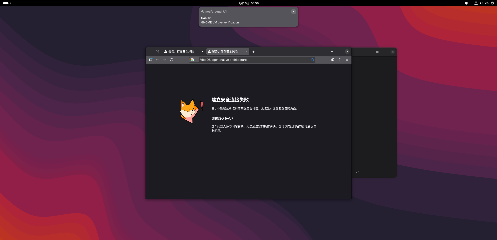
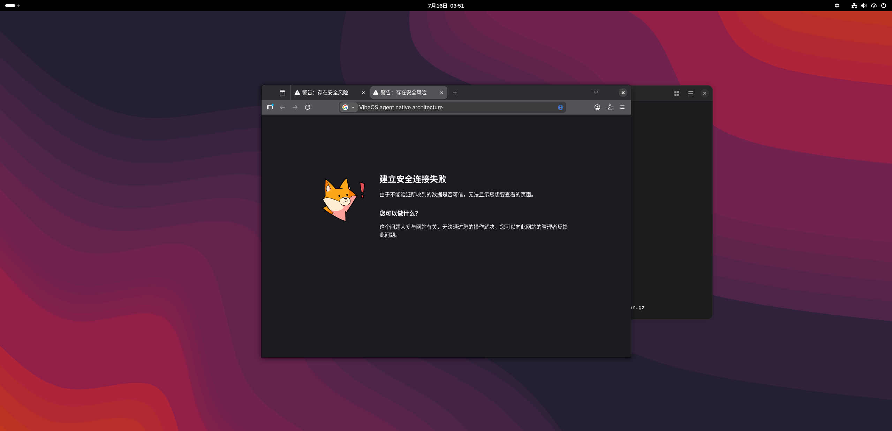

# Goal 01 Fedora GNOME VM Acceptance — 2026-07-16

## Scope

This run used VMware Guest Operations without mouse or keyboard input. The
guest was Fedora 44 with GNOME Wayland, the production `vibed --dbus` systemd
user service, the configured live DeepSeek provider, and the production desktop
adapters. Goal documents under `docs/goals/agent_native/` were not modified.

## Quality gates in the VM

```text
Ruff lint                         passed
Ruff format                       passed
strict mypy                       0 issues in 35 source files
architecture guard               0 violations
pytest                            302 passed in 5.49s
daemon lifecycle                 ready
daemon active requests after run 0
```

## Goal 01 E1 notification

The live request was `notify Goal 01 GNOME VM live verification` through the
production D-Bus daemon. It completed in 42 seconds with exit code 0.

```text
intent.action                     notification.send
transport                         dbus
execution_status                  succeeded
acceptance_status                 passed
overall_status                    completed
receipt.effect_level              E1
receipt.status                    succeeded
receipt.adapter                   notifications.send
receipt.adapter_status            succeeded
delivery_adapter                  /usr/bin/notify-send
desktop effect                    independently visible
```

`dbus-monitor` recorded the real `org.freedesktop.Notifications.Notify` method
call with title `Goal 01` and body `GNOME VM live verification`. The screenshot
independently shows the GNOME notification:



The first live attempt also found a real contract bug: the provider emitted a
generic target containing `name` and `kind`, which the strict foundation slice
correctly rejected. Notification target canonicalization now maps `name` to the
contract `body` and drops non-contract metadata; a production-path regression
test covers that shape.

## Browser side-effect boundary

The first browser run failed at the `gdbus` default timeout after about 25
seconds while the daemon continued. The D-Bus client now explicitly passes the
configured VibeOS transport timeout to `gdbus`. After the fix, the live request
ran for 67 seconds, returned normally, and left zero active requests. Firefox
opened and received the requested search query:



The page failed its TLS connection, so VibeOS reported execution succeeded,
semantic acceptance indeterminate, and the overall result incomplete. This is
correct side-effect and failure-reporting evidence; it is not claimed as a
successful web search and is not substituted for the selected Goal 01 E1
notification slice.

## Retained artifacts

| Artifact | SHA-256 |
| --- | --- |
| `../../../.codex_vm_artifacts/vibeos-goal01-notification-retest.tar.gz` | `63B3B9D8B7ED7849C6E4386A5E041D765353E410F7C20FA15C626893BF13694B` |
| `../../../.codex_vm_artifacts/notification-retest.png` | `AC2C469C42E5E5DCBD03DB888448348A91AB2BB43BD884023A566F00C63555E4` |
| `../../../.codex_vm_artifacts/vibeos-goal01-live-retest.tar.gz` | `C93097479582B81A7C0A9A5D95847565CA7F521BC5017C4D4F2BC7B8AAE66B0F` |
| `../../../.codex_vm_artifacts/browser-live.png` | `2408B0E294FFE2EE389A94FE5108B300B2DD8616D113243180D35B4E895A9E03` |
