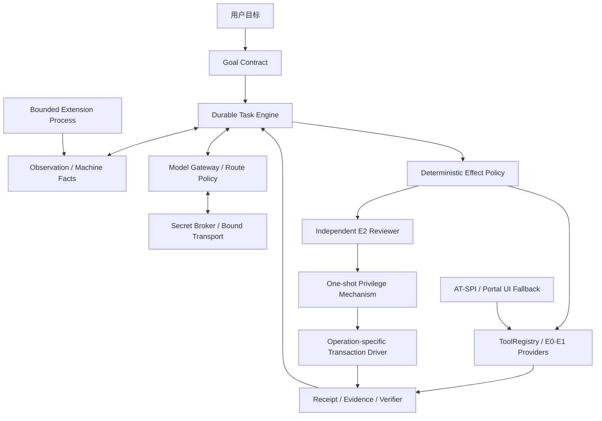

# VibeOS Agent-native 实施计划

- 状态：Goal 01–03 已执行；Goal 04–11 已按“唯一地基、纵向证明、证据驱动扩展”重排
- 制定日期：2026-07-15
- 最近修订：2026-07-19

## 1. 计划目的与当前边界

本目录把 VibeOS 从可测试原型迁移为可信 Linux 个人 Agent 的工作拆成可直接交给
Codex 的 Goal。每份 Goal 独立包含项目思想、现场起点、固定用户结果、实施边界、
停止条件、验收和交付物；不要求 Codex 读取本次聊天记录。

Goal 01、02、03 已经执行，是历史合同和决策来源。它们保留原有阶段编号和正文，
只允许更新必要导航，不应按新路线重新执行：

- Goal 01 建立稳定基础；
- Goal 02 产生 Durable Task Engine 候选；
- Goal 03 从 Goal 01 干净基线审计、整合并删除经证明可替代的旧任务内核。

制定本轮计划时，本地 `main` 已到 `d792b06`，但 Goal 03 的 Fedora GNOME remediation
仍有未提交生产代码、测试和证据，`origin/main` 也没有发布这些本地提交。因此 Goal 04
的第一门禁不是继续写功能，而是确认 Goal 03 补充工作已被明确归属并形成干净、可回退
基线。现场代码和 Git 状态会变化，执行者必须重新核对，不能把本段快照当永久事实。

执行任何阶段前必须阅读：

1. [产品章程](../../product/product_charter.md)；
2. [总体系统框架](../../product/agent_system_framework.md)；
3. [Agent-native 方向决策](../../product/decisions/0001-agent-native-direction.md)；
4. [实施技术底座决策](../../product/decisions/0002-implementation-foundation.md)；
5. [方向、代码与计划可行性审计](00_alignment_and_code_baseline.md)；
6. [当前状态](../../architecture/current_status.md)、Git 历史和当前源代码。

优先级是：用户最新明确决定与产品章程 > 已接受 ADR > 当前阶段 Goal > 旧状态文档。
源代码、Git 历史和实际测试是实现事实。若事实与 Goal 的预期起点冲突，先报告并收窄
修订，不能自行扩大成全仓重构。

## 2. 项目总体思想

VibeOS 不是自然语言命令解析器，也不是只会点击的 GUI Agent。它是运行在个人 Linux
设备上的 Agent-native 计算层：用户给出目标和现实边界，Agent 持续理解整台机器，
优先使用 API、CLI、D-Bus 和系统服务，必要时才使用 UI，自主处理技术细节，并根据
独立证据判断任务是否完成。

Agent 的优势包括命令行、API、结构化系统接口、长时间运行、机器事实和崩溃恢复；
UI 是能力补全层，不是默认执行层。实质歧义必须先问用户，普通技术选择由 Agent 自主
处理。Agent 自行判断是否完成，但动作返回、模型判断或测试 fixture 都不能单独作为
现实完成证据。

云端模型承担高能力推理；本地模型只有对明确 purpose 通过质量、隐私、延迟和资源
基准后才能进入路由。模型不能决定权限、数据等级、secret scope 或现实完成状态。

效果治理使用 E0-E4：

| 等级 | 含义 | 决策边界 |
| --- | --- | --- |
| E0 | 观察，无现实副作用 | 在 GoalContract 范围内自动执行并记录 |
| E1 | 可逆、有限的本地用户态动作 | 自动执行、独立验证并记录 |
| E2 | 需要提权且能证明完整回滚的本地动作 | 独立 Reviewer + 确定性 policy + 最小权限 |
| E3 | 外部承诺、私人数据外传、不可逆破坏或重大安全变化 | 每个动作由用户批准 |
| E4 | 禁止或没有安全实现 | 拒绝 |

现有 `L0-L3` 是 Goal 01–03 留下的未发布技术债，不是长期公共兼容承诺。Goal 04 必须
通过新增 migration、公共 contract 版本变更和逐 capability 重分类一次性迁移旧数据，
随后从 production 源码、数据库当前 schema、CLI/D-Bus/HTTP/Python payload 和测试删除
`L0-L3`/`risk_level`。历史 migration、归档证据和旧数据 fixture 可以保留旧字样，但
运行时不得提供双字段、别名或兼容 policy。

Secret Broker 只允许秘密用于绑定的 transport/action，不向 Agent Core、模型、CLI、
D-Bus、HTTP、扩展、任务数据库或日志返回明文。首期同 UID 威胁边界必须诚实记录，
不得用接口封装冒充 OS 级隔离。

系统先作为现有 Linux 上的可安装 Runtime 交付；是否创建定制镜像或独立发行版，最后
依据黄金场景、升级恢复、权限/秘密生命周期和长期维护成本决定。

## 3. 不可破坏的核心准则

后续 Goal 无论如何实现，都必须遵守：

1. **一个耐久任务权威**：一个 Durable Task Engine、一个规范 Task Store、一个领域
   状态机；兼容入口无独立任务、审批、澄清或恢复状态。
2. **每类边界一个 production owner**：一个只接受 E0-E4 的 Effect Policy、一个 ToolRegistry、一个
   Observation/Context 路径、一个 Model Gateway、一个 Secret Broker、一个 daemon
   lifecycle；compatibility facade 只能转发和投影。
3. **从真实纵向任务生长抽象**：先固定用户结果、资源、效果和证据，再增加最小合同；
   不为想象中的未来插件、命令或发行版建设通用平台。
4. **API/CLI 优先，UI 分级 fallback**：系统/应用 API -> D-Bus -> 固定结构化 CLI ->
   AT-SPI -> 用户授权 portal/视觉输入；不可越级到未治理输入。
5. **实质歧义先澄清**：对象、外部后果、数据范围或完成条件不明确时先问；技术细节
   不反复要求用户代替 Agent 决策。
6. **秘密不可读，只可受限使用**：没有面向 Core/模型的 plaintext getter；grant 绑定
   task、operation、endpoint、次数、期限和 policy version。
7. **模型是提议者，不是权限根**：所有模型输入最小化、输出 strict、预算有限；路由、
   effect、secret 和 completion 由确定性代码裁决。
8. **副作用可对账**：proposal 先持久化，动作有 timeout、idempotency/receipt、独立
   verify 和 unknown-outcome reconciliation；不盲目重复外部动作。
9. **回滚是操作/发布专属合同**：E2 需要完整 compensator；版本回退使用兼容的
   artifact/database pair，不把旧代码指向升级数据库。
10. **删除晚于证明**：replacement matrix、真实调用者、等价合同、回退提交和用户批准
    齐全后才能删除生产路径。
11. **诚实区分环境**：mock、fixture、WSL、Fedora GNOME VM 和真实 provider 各自只
    证明其覆盖边界；不能把接口存在、dry-run 或命令退出零写成现实成功。

## 4. 目标架构



实现是本地模块化单体，不是微服务集合。一个 SQLite 数据库可以容纳多个清晰的领域
聚合，但 Task、Finding/Suggestion、事实缓存和扩展 metadata 各有明确 owner；不能用
“同一个数据库”掩盖重复状态机。一个 asyncio supervisor 管理 D-Bus、worker、timer、
outbox 和恢复。调度是 at-least-once，通过 lease、幂等、receipt 和 reconciliation
保障副作用安全。

## 5. 阶段与执行顺序

| 顺序 | Codex Goal | 核心结果 | 规模 | 风险 |
| --- | --- | --- | --- | --- |
| 01 | [核心基础替换](01_core_foundation_replacement.md) | 已执行历史：Goal 01 稳定基线 | L | 中 |
| 02 | [持久任务引擎](02_durable_task_engine.md) | 已执行历史：Goal 02 候选 | XL | 高 |
| 03 | [整合 Goal 01/02](03_reconcile_goal01_goal02.md) | 已执行历史：唯一耐久基线与兼容证据 | XL | 高 |
| 04 | [最小执行地基与 systemd 验收](04_core_execution_foundation_and_system_service_slice.md) | 唯一 effect/registry/Gateway/SecretRef 地基和首个纵向证明 | XL | 高 |
| 05 | [Model Gateway 与 Secret Broker](05_model_gateway_and_secret_broker.md) | 云端路由、本地准入和秘密使用唯一入口 | XL | 高 |
| 06 | [用户态任务与基础 Runtime](06_unprivileged_tasks_and_installable_runtime.md) | 四个固定 API/CLI 任务和可安装 artifact | XL | 中高 |
| 07 | [GNOME 混合任务](07_gnome_mixed_task_mvp.md) | API 优先、AT-SPI/portal fallback 和用户接管 | XL | 高 |
| 08 | [单一 E2 与完整回滚](08_privileged_canary_and_rollback.md) | 一个 Reviewer/最小权限/事务 canary | XL | 极高 |
| 09 | [主动服务建议](09_proactive_service_advisor.md) | 一个可抑制、由用户决定的 detector | M | 中 |
| 10 | [Runtime 发布生命周期](10_runtime_release_lifecycle.md) | 安装、升级、失败恢复、卸载和支持矩阵 | XL | 高 |
| 11 | [只读扩展与发行版门禁](11_readonly_extension_and_distro_gate.md) | 一个隔离 E0 扩展和实证发行版 ADR | L | 中高 |

推荐严格串行。Goal 07 不依赖 E2，因此放在 Goal 08 前先证明项目的核心“使用电脑”
价值；Goal 08 再增加高风险提权。只允许并行开展不改生产代码的 feasibility spike，
结论不能替代前置 Goal 的退出门禁。

里程碑：

| 里程碑 | Goal | 用户可观察退出结果 |
| --- | --- | --- |
| A 已执行历史 | 01–03 | 旧新内核被审计整合成唯一耐久基线 |
| B 受治理系统 Agent | 04–06 | 真实 service 任务、多模型/秘密边界、少量用户态任务和基础安装 |
| C 桌面与权限 | 07–08 | 一个真实 GNOME 混合任务和一个可完整回滚的 E2 canary |
| D 协作 | 09 | 一个有证据、可忽略/稍后/抑制的主动建议 |
| E 产品化与方向 | 10–11 | 稳定 Runtime 生命周期、一个只读扩展和发行版 ADR |

## 6. 为什么 Goal 04 使用 systemd user service

该场景是地基验收试件，不是先于地基的孤立功能。它同时覆盖机器事实、模型诊断、
E0/E1、API/D-Bus、receipt、崩溃恢复和独立完成判断，又能限制在专用 user fixture，
不需要 root、portal 或桌面视觉。

Goal 04 必须按 04A 地基收敛 -> 04B 场景实现 -> 04C 崩溃/真实环境验收执行。04A
未形成唯一权威时不得开始场景专用代码。完整多 provider 路由、通用 Secret Broker、
E2 和桌面能力分别由后续 Goal 承担。

## 7. 共同执行命令

把任一 Goal 直接发送给 Codex 时，Codex 必须：

1. 完整阅读该 Goal、总 README、产品章程、ADR、当前状态、AGENTS.md 和相关源码；
2. 记录分支、HEAD、remote、worktree、未提交差异、并发修改者和数据库 revision；
3. 保护用户和其他任务的改动，不使用 reset/checkout/clean、覆盖、批量删除或盲目
   `git add -A` 制造干净起点；
4. 核对预期进入状态。冲突时先报告差异、影响和最小调整，不自行扩大范围；
5. 固定本阶段用户结果、允许效果、数据范围、真实环境和停止条件，再修改代码；
6. 复用现有权威边界，不新增平行 Task Store、Registry、policy、Gateway、secret
   store 或 daemon；
7. 对外部/持久化/模型/扩展输入做 strict validation，失败默认关闭而非猜测；
8. 通过事务、幂等、超时、取消、lease、receipt、reconciliation 和独立 verify 处理
   长任务与崩溃；
9. 删除前提交 replacement/caller/compatibility/rollback 证据并获得所需批准；
10. 使用真实 adapter 和观察验收；mock 只用于单元与故障注入；
11. 更新当前状态、架构、迁移、威胁模型和运维文档，区分 committed、worktree、WSL、
    VM、fixture、provider smoke 和未实现边界；
12. 在硬验收满足前继续工作，不把 scaffolding、接口、测试数量或 dry-run 当作完成。

遇到需要改变固定场景、增加 effect 等级、扩大数据范围、安装特权机制、修改支持平台、
真实使用 provider credential、删除生产路径或创建发行版实现时，必须展示证据和最小
方案并取得该 Goal 要求的用户决定。普通实现细节仍由 Codex 自主处理。

## 8. 共同质量门禁

每个阶段至少保持当前准确版本的以下门禁通过：

```bash
python -m ruff check src tests
python -m ruff format --check src tests
python -m mypy --strict
python -m pytest -q
python scripts/architecture_guard.py
vibe capabilities --json
vibe ask "search web for hello" --json --offline --dry-run
```

执行者必须从 `pyproject.toml`、CI 和运维文档复核真实命令，不机械复制过期文件数或
测试数。此外必须满足：

- 新 production 模块进入严格类型和 architecture ratchet；不新增 legacy exception；
- schema 有 additive migration、旧数据 fixture、upgrade/失败恢复和 revision 验证；
- 状态转换表驱动或属性测试覆盖，没有未声明终态；
- 外部调用有总 deadline、取消、有限重试、输出和资源上限；
- secret/PII 高熵 canary 与日志/DB/trace/export 扫描通过；
- 真实副作用由独立观察验证，不以返回零、模型判断或 fixture 内部状态替代；
- GNOME、systemd、D-Bus、Secret Service、portal、polkit 和安装在目标 VM 留下可复核
  证据；WSL 只证明非桌面路径；
- 文档链接、当前状态、artifact/schema/hash 和支持声明与当前代码一致。

## 9. 停止与回退规则

出现以下任一情况时停止扩大范围：

- 进入状态、分支或工作树归属不清，仍有其他任务修改同一生产路径；
- 某类状态、Registry、policy、Gateway 或 secret 形成两个 production owner；
- 删除没有替代矩阵、真实调用者、等价证据、回退提交或必要批准；
- secret 明文可进入 Core/模型/日志/持久化/扩展，或 sandbox/helper 存在可重复越权；
- action 无法建立 receipt、独立 verify、unknown-outcome reconciliation 或要求的回滚；
- 数据库迁移/发布无法恢复到兼容 artifact/database pair；
- portal/AT-SPI/真实 provider/目标发行版能力与承诺不一致；
- 固定真实场景不能证明新增平台抽象的价值。

Codex 应完成仓库内仍安全、仍在范围内的工作，保留旧产品能力，记录精确阻塞和最小
替代方案。不得为关闭阶段而关闭安全检查、扩大权限、删除未证明冗余的实现，或把
外部环境缺失写成实现成功。

## 10. 总体完成定义

Goal 04–11 全部完成后，用户应能在受支持 GNOME Linux 上安装稳定 VibeOS，交给它
一个持续数小时、包含系统、命令和桌面步骤的真实任务，并观察到：

- Agent 基于新鲜、最小、可追溯机器事实规划，优先选择 API/CLI/D-Bus；
- 实质歧义先澄清，技术细节由 Agent 自主处理；
- 云端模型经统一 Gateway 路由，本地模型只有通过 purpose 基准才参与；
- secret 只由绑定 transport 使用，不进入 Agent/模型/日志/任务状态；
- 任务可等待、暂停、重启恢复、取消和用户接管，不重复未知副作用；
- E0/E1 在约束内执行，一个 E2 canary 经独立审核和完整回滚，E3 逐动作问用户；
- UI 只在语义接口不足时使用，并在真实 GNOME 会话验证；
- Agent 用独立证据判断完成并解释失败、等待和剩余风险；
- 一个主动建议默认不执行，一个只读扩展不能绕过 Core；
- 安装、升级、失败恢复、卸载和重装可重复；
- 是否继续 Runtime、探索定制镜像或发行版已有基于真实证据的正式决策。

在此之前，项目应称为受控开发中的 Linux Agent Runtime，而不是完成的个人操作系统
或通用电脑用户替身。
