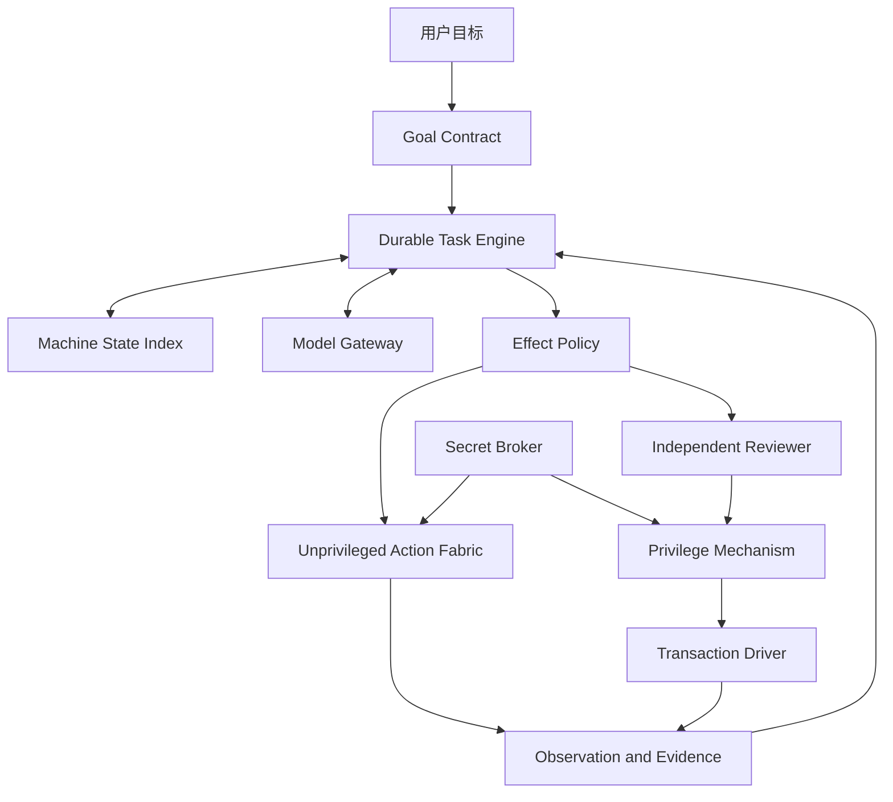
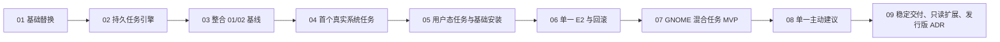

# VibeOS Agent-native 实施计划

- 状态：Goal 01/02 已执行；Goal 03–09 已按整合优先路线修订
- 制定日期：2026-07-15
- 最近修订：2026-07-16

## 1. 计划目的

本目录把 VibeOS 从可测试原型迁移为可信 Linux 个人 Agent 的工作拆成九个可直接
交给 Codex 的 Goal。Goal 01、02 是已经执行的历史命令，保留原文作为决策和代码
来源记录；它们的执行结果必须先经过新 Goal 03 整合，不能把当前未提交 Goal 02
工作树直接当成后续稳定起点。Goal 04–09 已改为以真实用户结果为主的纵向阶段。

每份新 Goal 既说明项目总体思想，也限定本阶段的核心结果、现场进入状态、兼容/
删除门禁和可机器判断的验收条件。Goal 03–09 的文件名、标题和实际任务一致；已执行
Goal 02 只更新了指向新 Goal 03 的导航链接，历史目标内容保持不变。

执行任何阶段前必须阅读：

1. [产品章程](../../product/product_charter.md)；
2. [总体系统框架](../../product/agent_system_framework.md)；
3. [Agent-native 方向决策](../../product/decisions/0001-agent-native-direction.md)；
4. [实施技术底座决策](../../product/decisions/0002-implementation-foundation.md)；
5. [方向、代码与计划可行性审计](00_alignment_and_code_baseline.md)；
6. [当前状态](../../architecture/current_status.md)和当前源代码。

源代码、git 历史和本次实际测试是当前事实；产品章程和 ADR 是目标约束；阶段 Goal
是实施命令。若三者冲突，Codex 必须先记录差异；进入状态与文档快照不一致时不得
自行扩大重构。旧行数、测试数、接口名和“已完成”声明都需要现场复核。

## 2. 总体思想

VibeOS 不是自然语言命令解析器，也不是只会点击的 GUI Agent。它是运行在
个人 Linux 设备上的 Agent-native 计算层：用户给出目标和现实世界边界，Agent
持续理解整台机器，优先使用 API、CLI 和系统服务，必要时使用 UI，自主处理
技术细节，并根据真实证据判断任务是否完成。

信任模型按实际效果治理：E0/E1 自动执行；E2 是可回滚的本地提权，由与执行
Agent 隔离的 Reviewer 自动审核，再由确定性 policy 和最小特权机制强制；E3
涉及外部承诺、不可逆破坏、支付或重大安全影响，必须逐动作获得用户批准；E4
拒绝。Secret Broker 只把秘密注入目标进程，Agent 和模型不得看到明文。

云端模型承担高能力推理，本地模型只有通过基准后才进入路由。系统先作为现有
Linux 上的可安装 Runtime 交付；是否创建独立发行版在最后根据实证决定。

## 3. 实施架构



实现是本地模块化单体，不是微服务。一个 SQLite 数据库保存规范化当前状态、
追加式领域事件和 outbox；一个 asyncio supervisor 管理 D-Bus、worker、timer
和恢复。调度是 at-least-once，通过 lease、幂等键、receipt 和 reconciliation
保证副作用安全。详细选择见[决策 0002](../../product/decisions/0002-implementation-foundation.md)。

## 4. 阶段与依赖

九个 Goal 归入五个交付里程碑。Goal 01/02 的历史实现不因测试通过自动获得合并
资格；Goal 03 是独立整合门。后续每个里程碑必须交付用户可以观察到的结果：

| 里程碑 | Goal | 退出结果 |
| --- | --- | --- |
| A 已执行历史 | 01-02 | Goal 01 基线和 Goal 02 持久内核候选均可追溯 |
| B 整合基线 | 03 | 新旧行为有替代矩阵，形成可回退、可继续开发的唯一基线 |
| C 系统 Agent | 04-06 | 真实 user-service 任务、少量 API/CLI 能力和一个 E2 canary |
| D 桌面与协作 | 07-08 | 一个真实 GNOME 混合任务和一个用户可控主动建议 |
| E 产品化 | 09 | Runtime 稳定交付、一个只读扩展和发行版实证决策 |

没有团队容量、真实 VM 和 provider 预算前，本计划不虚构日历日期。排期时以
每个 Goal 的退出结果为交付单位；03、06、07 是关键路径上的高不确定阶段，应
为兼容核对、威胁建模、故障注入和返工预留独立容量，不能用功能点或测试数量
替代退出门禁。



| 顺序 | Codex Goal | 核心结果 | 规模 | 风险 |
| --- | --- | --- | --- | --- |
| 01 | [核心基础替换](01_core_foundation_replacement.md) | 已执行历史：Goal 01 稳定代码基线 | L | 中 |
| 02 | [持久任务引擎](02_durable_task_engine.md) | 已执行历史：Goal 02 持久内核候选与大规模迁移 | XL | 高 |
| 03 | [整合 Goal 01/02](03_reconcile_goal01_goal02.md) | 保存当前候选，从 Goal 01 干净基线分组整合并安全合入 | XL | 高 |
| 04 | [首个真实系统任务](04_system_service_recovery_vertical_slice.md) | 诊断/恢复 user service；最小模型、密钥、事实和 E0/E1 | L | 中高 |
| 05 | [用户态能力与基础安装](05_unprivileged_tasks_and_installable_runtime.md) | 四个固定 API/CLI 任务和可重复安装 Runtime | L | 中高 |
| 06 | [单一 E2 与完整回滚](06_privileged_canary_and_rollback.md) | Reviewer、最小权限和一个操作专属事务 canary | XL | 极高 |
| 07 | [GNOME 混合任务 MVP](07_gnome_mixed_task_mvp.md) | 一个真实混合任务、AT-SPI/portal fallback 和用户接管 | XL | 高 |
| 08 | [单一主动建议](08_proactive_service_advisor.md) | 一个有证据、可抑制、用户决定是否处理的 detector | M | 中 |
| 09 | [稳定交付与方向门禁](09_runtime_delivery_extension_and_distro_gate.md) | 升级恢复、一个只读扩展和发行版 ADR | L | 中高 |

规模是相对工程量，不是工期承诺：M 为单一子系统，L 为跨层迁移，XL 为包含
安全/崩溃/真实环境证明的关键路径阶段。

默认顺序严格串行。Goal 03 没有形成干净提交前不得开始 Goal 04；任何后续 Goal
若发现进入状态不符，应暂停扩大范围并更新现场审计。只允许并行开展不修改生产
代码的研究 spike，其结论不能代替前置阶段退出门禁。

## 5. 迁移策略：证据驱动收敛，不再大爆炸删除

Goal 01/02 已经证明，横向组件 Goal 加上“全部迁移并删除”的验收条件会让 Codex
把平台整洁置于用户行为兼容之前。Goal 03 起采用以下方式：

1. 盘点当前调用者、状态所有权、失败模式和测试；
2. 固定一个真实用户任务和完成证据，不先铺满所有抽象；
3. 只实现该任务需要的最小 schema、事实、provider 和 adapter；
4. 对受影响旧路径做输入、状态、错误、审批和证据等价测试；
5. 通过兼容 adapter 小范围切换并观察，不同时迁移所有能力；
6. 记录未迁移路径的 owner、真实调用者和明确复审阶段；
7. 删除必须经过独立 cutover gate：替代矩阵、真实调用者证据、回退提交和用户批准；
8. 更新架构、状态、运维文档，明确真实、fixture、WSL 和未实现边界。

兼容层必须记录真实调用者、owner、使用证据、删除条件和复审阶段；它可以在证据
不足时保留，但不能拥有第二套状态权威。任何阶段不得新增第二套 Task Store、风险
引擎、动作注册表或 daemon 生命周期。模型迁移允许按纵向场景经过同一 Gateway
逐步收敛，不得再次以“一次删除全部旧调用”为单阶段验收。

## 6. 所有 Goal 的共同执行命令

每份 Goal 必须能在没有本次聊天记录的情况下独立使用。固定场景、允许效果、进入
状态核对、停止条件、非目标、验收证据和交付物均以该文件为准。遇到以下情况不得
由 Codex 自行补全产品意图：需要更换固定用户场景、扩大数据范围、增加 effect 等级、
安装新特权机制、改变支持平台或删除仍可能有调用者的生产路径；必须先展示证据和
最小替代方案，获得用户确认后继续。普通实现细节仍由 Codex 自主处理。

把某份 Goal 直接发送给 Codex 时，Codex 必须：

1. 先检查工作树、`AGENTS.md`、依赖、生产入口、测试和目标文档；保留用户的
   无关改动；
2. 记录当前分支、HEAD、工作树差异和可能的并发修改者；不得用 reset/checkout、
   批量删除或覆盖未提交工作来制造干净起点；
3. 写出简短现场差异和实施顺序，再开始修改；进入状态或 ADR 假设失效时先报告，
   不能自行把 Goal 扩大为新的全仓重构；
4. 只实现本阶段固定真实场景和必要兼容，不顺手迁移全部同类模块；
5. 删除生产路径前提供 replacement matrix、真实调用者证据、等价测试和可回退提交；
   文档没有明确授权时必须请求用户批准；
6. 让领域层保持纯净，所有外部/动态边界先严格校验；
7. 通过事务、幂等、取消、超时和最小权限处理故障，不把异常吞成成功；
8. 对模型、扩展和持久化输入做 fail-closed 校验；模型不得决定权限或秘密规则；
9. 使用真实 adapter 和状态证据验收；mock 只用于单元故障注入；
10. 运行与风险相称的自动化、崩溃恢复、并发和真实 Linux 验证；
11. 更新当前状态、架构、迁移和运维文档，区分已实现、实验和 VM-only；
12. 在所有硬验收满足前继续工作，不把 scaffolding、接口或 dry-run 报告为完成。

## 7. 共同质量门禁

每个阶段至少保持以下当前门禁通过，并可随代码演进更新准确命令：

```bash
python -m ruff check src tests
python -m ruff format --check src tests
python -m mypy --strict
python -m pytest -q
vibe capabilities --json
vibe ask "search web for hello" --json --offline --dry-run
```

此外每个阶段必须满足：

- 新增 production 模块在严格类型检查范围内；
- import boundary、cycle、复杂度和 legacy exception 采用可机器检查的 ratchet：
  新代码不得新增例外，迁移阶段必须减少旧例外；
- schema 有 migration、upgrade 测试、旧数据 fixture 和失败恢复；
- 状态转换有属性/表驱动测试，不存在未声明的终态；
- 外部调用都有显式 timeout、取消、重试分类和资源上限；
- 日志、trace、DB 和错误消息通过 secret/PII 泄漏扫描；
- 真实副作用通过独立观察验证，不以“调用返回 0”直接等同目标完成；
- GNOME、systemd、D-Bus、polkit、Secret Service、portal 等集成在受支持 VM
  提供可复核证据，WSL 只证明非桌面部分；
- 文档链接和声明与当前代码一致。

## 8. 阶段停止与回退规则

出现以下任一情况时，不应继续扩大范围：

- Goal 的预期进入状态与现场代码明显不符，或仍有其他任务修改同一工作树；
- 删除项没有替代矩阵、真实调用者证据、等价测试或安全回退；
- 数据库在目标单机负载下无法满足已定义恢复/锁等待目标；
- sandbox、secret 注入或特权 helper 存在可重复越权/泄漏；
- action 无法建立可靠 receipt、reconciliation 或操作专属 rollback；
- portal/AT-SPI 的能力与产品承诺不一致；
- 新旧双路径无法在限定窗口内收敛；
- 真实用户场景不能证明新增平台抽象的价值。

Codex 应完成仓库内所有可完成工作，保留安全的旧产品能力，记录精确证据并新增
ADR 选择“修订目标、替代技术或停止该能力”。不得为赶阶段关闭安全检查、删除
未证明冗余的实现，也不得把外部环境缺失写成实现完成。

## 9. 总体完成定义

Goal 03–09 在已执行 Goal 01/02 基础上全部完成后，用户应能在支持的 GNOME Linux
上安装稳定 VibeOS，
交给它一个持续数小时且包含系统、命令和桌面步骤的真实任务，并观察到：

- Agent 基于新鲜机器事实规划，优先选择可验证 API/CLI/服务路径；
- 实质歧义先澄清，技术细节由 Agent 自主处理；
- 任务可等待、暂停、重启恢复、取消和用户接管，不重复已提交副作用；
- E0/E1 在明确约束中执行，一个 E2 canary 经独立审核和操作专属回滚，E3 逐次询问；
- 秘密不进入 Agent/模型/日志/快照；
- UI 只在语义接口不足时使用，且在真实 GNOME 会话验证；
- Agent 用独立证据判断完成并解释失败或剩余工作；
- 一个主动建议默认不执行，一个只读扩展不能绕过 Core；
- 安装、升级、卸载和恢复可重复，是否做独立发行版已有基于数据的正式决策。

在此之前，项目应称为受控开发中的 Linux Agent Runtime，而不是完成的个人
操作系统或通用电脑用户替身。
