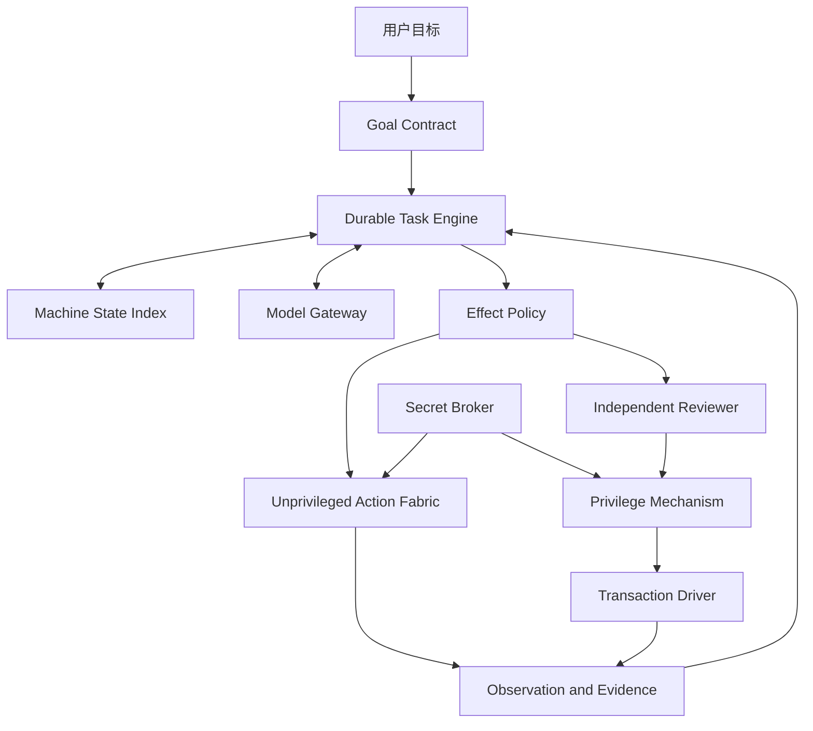

# VibeOS Agent-native 实施计划

- 状态：已审计、待执行
- 制定日期：2026-07-15

## 1. 计划目的

本目录把 VibeOS 从当前可测试原型迁移为可信 Linux 个人 Agent 的工作拆成九个
可直接交给 Codex 的 Goal。每份文档既说明项目总体思想，也限定本阶段的核心
结果、成熟技术路线、迁移/删除门禁和可机器判断的验收条件。

执行任何阶段前必须阅读：

1. [产品章程](../../product/product_charter.md)；
2. [总体系统框架](../../product/agent_system_framework.md)；
3. [Agent-native 方向决策](../../product/decisions/0001-agent-native-direction.md)；
4. [实施技术底座决策](../../product/decisions/0002-implementation-foundation.md)；
5. [方向、代码与计划可行性审计](00_alignment_and_code_baseline.md)；
6. [当前状态](../../architecture/current_status.md)和当前源代码。

源代码和本次实际测试是当前事实；产品章程和 ADR 是目标约束；阶段 Goal 是
实施命令。若三者冲突，Codex 必须先记录差异，按产品约束修订实现和文档，不
能机械相信旧行数、测试数或接口名。

## 2. 总体思想

VibeOS 不是自然语言命令解析器，也不是只会点击的 GUI Agent。它是运行在
个人 Linux 设备上的 Agent-native 计算层：用户给出目标和现实世界边界，Agent
持续理解整台机器，优先使用 API、CLI 和系统服务，必要时使用 UI，自主处理
技术细节，并根据真实证据判断任务是否完成。

信任模型按实际效果治理：E0/E1 自动执行；E2 是可回滚的本地提权，由与执行
Agent 隔离的 Reviewer 自动审核，再由确定性 policy 和最小特权机制强制；E3
涉及外部承诺、不可逆破坏、支付或重大安全影响，必须逐动作获得用户批准；E4
拒绝。Secret Broker 只把秘密注入目标进程，Agent 和模型不得看到明文。

云端模型承担高能力推理，本地模型只有通过基准后才进入路由。系统先作为现有
Linux 上的可安装 Runtime 交付；是否创建独立发行版在最后根据实证决定。

## 3. 实施架构



实现是本地模块化单体，不是微服务。一个 SQLite 数据库保存规范化当前状态、
追加式领域事件和 outbox；一个 asyncio supervisor 管理 D-Bus、worker、timer
和恢复。调度是 at-least-once，通过 lease、幂等键、receipt 和 reconciliation
保证副作用安全。详细选择见[决策 0002](../../product/decisions/0002-implementation-foundation.md)。

## 4. 阶段与依赖

九个 Goal 归入四个交付里程碑，避免把“完成若干组件”误当成产品进展：

| 里程碑 | Goal | 退出结果 |
| --- | --- | --- |
| A 核心替换 | 01-02 | 唯一持久任务内核接管现有能力，旧生产内核删除 |
| B 认知与数据边界 | 03-04 | 模型/秘密收口，Machine State 对真实规划产生可测收益 |
| C 受治理的电脑操作 | 05-07 | E0/E1、一个 E2 canary 和真实 GNOME MVP 完成 |
| D 协作与产品化 | 08-09 | 主动建议、扩展和稳定交付成立，发行版有正式决策 |

没有团队容量、真实 VM 和 provider 预算前，本计划不虚构日历日期。排期时以
每个 Goal 的退出结果为交付单位；02、06、07 是关键路径上的高不确定阶段，应
为威胁建模、故障注入和返工预留独立容量，不能用功能点完成率替代退出门禁。


| 顺序 | Codex Goal | 核心结果 | 规模 | 风险 |
| --- | --- | --- | --- | --- |
| 01 | [核心基础替换](01_core_foundation_replacement.md) | 新分层、统一 schema/迁移、单 daemon 生命周期和两个垂直切片 | L | 中 |
| 02 | [持久任务引擎](02_durable_task_engine.md) | 小时级任务、崩溃恢复、接管；迁移 19 个能力并删除旧内核 | XL | 高 |
| 03 | [Model Gateway 与 Secret Broker](03_model_gateway_and_secret_broker.md) | 收敛全部模型调用，使 Agent 不接触 provider secret 明文 | L | 高 |
| 04 | [机器状态与上下文路由](04_machine_state_and_context_routing.md) | 最小 Machine State Index、数据裁剪和本地模型证据门 | M | 中高 |
| 05 | [普通 Action Fabric](05_unprivileged_action_fabric.md) | API 优先的 E0/E1 执行、sandbox、receipt 和证据 | L | 高 |
| 06 | [特权控制与按操作回滚](06_privileged_control_and_rollback.md) | E0-E4、Reviewer、polkit 和一个真实 E2 事务 canary | XL | 极高 |
| 07 | [桌面 Action Fabric 与 Linux MVP](07_desktop_and_linux_mvp.md) | AT-SPI/portal fallback 和真实 GNOME 黄金闭环 | XL | 高 |
| 08 | [主动建议与用户协作](08_proactive_advisor.md) | 有证据、可抑制、默认不执行的建议生命周期 | M | 中 |
| 09 | [扩展、稳定交付与发行版门禁](09_extensions_delivery_and_distro_gate.md) | 安全扩展、可重复安装升级、发行版 ADR | L | 中高 |

规模是相对工程量，不是工期承诺：M 为单一子系统，L 为跨层迁移，XL 为包含
安全/崩溃/真实环境证明的关键路径阶段。

默认顺序是严格串行，因为每阶段都会收窄下一阶段的安全和状态假设。只允许
并行开展不修改生产代码的研究 spike；其结论不能代替前置阶段的退出门禁。

## 5. 迁移策略：替换而不是打补丁

每一阶段都采用相同的垂直替换方式：

1. 盘点当前调用者、状态所有权、失败模式和测试；
2. 建立新模块边界及 contract test，不先铺满所有抽象；
3. 迁移一个真实只读切片和一个真实有副作用切片；
4. 对新旧路径做固定输入、状态、错误和证据等价测试；
5. 把生产入口切换到新路径并观察；
6. 迁移剩余能力；
7. 删除旧入口、兼容开关、未使用 adapter 和重复测试；
8. 更新架构、状态和运维文档。

兼容层必须在同一阶段文档中记录：真实调用者、owner、遥测、删除条件和最迟
删除阶段。不能以“以后可能有人使用”为由永久保留。任何阶段不得新增第二套
Task Store、风险引擎、动作注册表、模型客户端或 daemon 生命周期。

## 6. 所有 Goal 的共同执行命令

把某份 Goal 直接发送给 Codex 时，Codex 必须：

1. 先检查工作树、`AGENTS.md`、依赖、生产入口、测试和目标文档；保留用户的
   无关改动；
2. 写出简短现状差异和实施顺序，再开始修改；发现 ADR 假设失效时先补 ADR；
3. 只实现本阶段和必要迁移，不顺手扩张后续能力；
4. 让领域层保持纯净，所有外部/动态边界先严格校验；
5. 通过事务、幂等、取消、超时和最小权限处理故障，不把异常吞成成功；
6. 对模型、扩展和持久化输入做 fail-closed 校验；模型不得决定权限或秘密规则；
7. 使用真实 adapter 和状态证据验收；mock 只用于单元故障注入；
8. 运行与风险相称的自动化、崩溃恢复、并发和真实 Linux 验证；
9. 更新当前状态、架构、迁移和运维文档，区分已实现、实验和 VM-only；
10. 在所有硬验收满足前继续工作，不把 scaffolding、接口或 dry-run 报告为完成。

## 7. 共同质量门禁

每个阶段至少保持以下当前门禁通过，并可随代码演进更新准确命令：

```bash
python -m ruff check src tests
python -m ruff format --check src tests
python -m mypy --strict
python -m pytest -q
vibe capabilities --json
vibe ask "search web for hello" --json --offline --dry-run
```

此外每个阶段必须满足：

- 新增 production 模块在严格类型检查范围内；
- import boundary、cycle、复杂度和 legacy exception 采用可机器检查的 ratchet：
  新代码不得新增例外，迁移阶段必须减少旧例外；
- schema 有 migration、upgrade 测试、旧数据 fixture 和失败恢复；
- 状态转换有属性/表驱动测试，不存在未声明的终态；
- 外部调用都有显式 timeout、取消、重试分类和资源上限；
- 日志、trace、DB 和错误消息通过 secret/PII 泄漏扫描；
- 真实副作用通过独立观察验证，不以“调用返回 0”直接等同目标完成；
- GNOME、systemd、D-Bus、polkit、Secret Service、portal 等集成在受支持 VM
  提供可复核证据，WSL 只证明非桌面部分；
- 文档链接和声明与当前代码一致。

## 8. 阶段停止与回退规则

出现以下任一情况时，不应继续扩大范围：

- 数据库在目标单机负载下无法满足已定义恢复/锁等待目标；
- sandbox、secret 注入或特权 helper 存在可重复越权/泄漏；
- action 无法建立可靠 receipt、reconciliation 或操作专属 rollback；
- portal/AT-SPI 的能力与产品承诺不一致；
- 新旧双路径无法在限定窗口内收敛；
- 真实用户场景不能证明新增平台抽象的价值。

Codex 应完成仓库内所有可完成工作，保留安全的旧产品能力，记录精确证据并
新增 ADR 选择“修订目标、替代技术或停止该能力”。不得为赶阶段而关闭安全
检查，也不得把外部环境缺失写成实现完成。

## 9. 总体完成定义

九个 Goal 全部完成后，用户应能在支持的 GNOME Linux 上安装稳定 VibeOS，
交给它一个持续数小时且包含系统、命令和桌面步骤的真实任务，并观察到：

- Agent 基于新鲜机器事实规划，优先选择可验证 API/CLI/服务路径；
- 实质歧义先澄清，技术细节由 Agent 自主处理；
- 任务可等待、暂停、重启恢复、取消和用户接管，不重复已提交副作用；
- E0/E1 在明确 sandbox 中执行，E2 经独立审核和操作专属回滚，E3 逐次询问；
- 秘密不进入 Agent/模型/日志/快照；
- UI 只在语义接口不足时使用，且在真实 GNOME 会话验证；
- Agent 用独立证据判断完成并解释失败或剩余工作；
- 主动建议默认不执行，扩展不能绕过 Core；
- 安装、升级、卸载和恢复可重复，是否做独立发行版已有基于数据的正式决策。

在此之前，项目应称为受控开发中的 Linux Agent Runtime，而不是完成的个人
操作系统或通用电脑用户替身。
