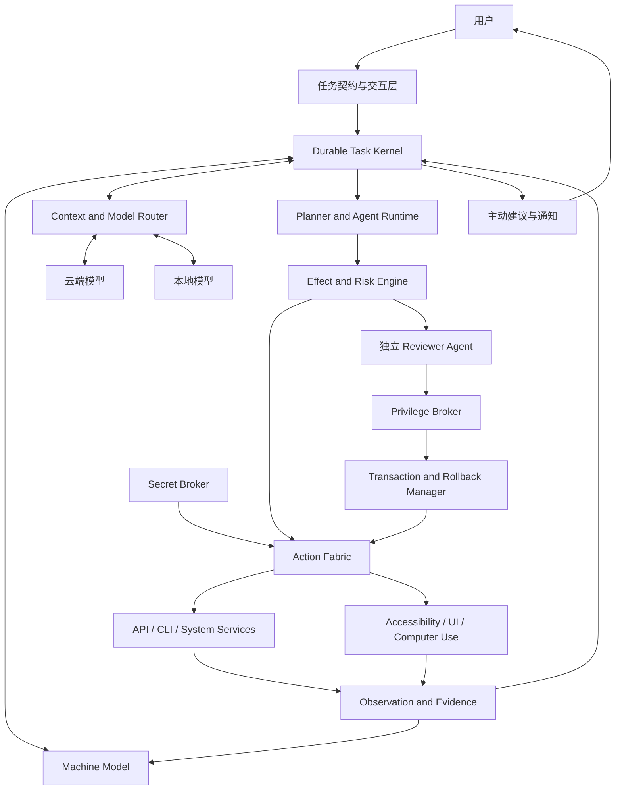

# VibeOS Agent 总体系统框架

状态：已确认目标架构基线
更新日期：2026-07-15

## 1. 文档目的

本文把[产品章程](product_charter.md)转换成目标系统框架。它说明未来系统
需要哪些核心组件、组件之间如何协作，以及权限、秘密、模型、长期任务和
回滚应处在什么位置。

本文不是当前实现说明。现有生产路径和已验证能力以
[当前状态](../architecture/current_status.md)和
[运行时架构](../architecture/runtime_convergence.md)为准。

## 2. 目标系统总览



系统由四个平面组成：

1. **目标与任务平面**：任务契约、Task Kernel 和 Agent Runtime；
2. **机器与模型平面**：Machine Model、Context Router 和模型提供商；
3. **信任控制平面**：影响判断、Reviewer、Privilege Broker、Secret Broker
   和 Rollback Manager；
4. **动作与证据平面**：API、CLI、系统服务、UI、观察和证据。

扩展能力必须接入这些平面，不能建立绕过信任控制和任务状态的旁路。

## 3. 任务契约与交互层

任务入口负责把用户请求转换成 Agent 可以自主执行的契约。

### 输入

- 用户自然语言目标；
- 用户偏好、长期授权和隐私策略；
- 时间、成本、设备和资源限制；
- 当前会话上下文。

### 输出

`GoalContract` 至少包含：

```text
goal_id
objective
scope
constraints
completion_conditions
allowed_effects
user_decision_points
privacy_policy
time_budget
cost_budget
```

如果目标、范围、对象、完成条件或现实世界后果存在实质歧义，系统必须先
询问用户。契约明确后，中间的技术决策默认交给 Agent。

## 4. Durable Task Kernel

Task Kernel 是目标系统的状态权威，不是某次模型对话。

### 核心职责

- 创建和持久化任务；
- 管理阶段、步骤、尝试和依赖；
- 等待时间、事件或外部条件；
- 暂停、恢复、取消和超时；
- 机器重启后的恢复；
- 用户接管、修改和交还控制；
- 记录模型决策、动作、证据和最终结果；
- 防止恢复时重复已完成副作用。

### 关键对象

```text
GoalContract
TaskRun
PlanRevision
Step
Attempt
ActionProposal
EffectAssessment
Observation
EvidenceBundle
Decision
TerminalOutcome
```

Goal 03 已把历史 GoalLoop 验证过的状态语义迁入纯 transition Durable Task
Engine，并在公共契约等价后删除旧同步循环。当前内核支持小时级 fake-clock
等待、事件唤醒、系统重启扫描和用户接管；真实产品纵切仍按后续阶段验收。

## 5. Machine Model

Machine Model 让 Agent 比用户更全面地理解电脑。

### 数据域

- `hardware`：CPU、内存、GPU、磁盘、外设和电源；
- `os`：发行版、内核、启动、驱动和安全状态；
- `packages`：软件包、来源、版本、依赖和更新；
- `services`：systemd 服务、作业、进程、端口和健康状态；
- `storage`：文件系统、挂载、容量、快照和备份；
- `network`：接口、连接、DNS、代理和目标策略；
- `identity`：本机账号、组、权限和 Secret Reference；
- `desktop`：会话、应用、窗口、通知、剪贴板和浏览器；
- `history`：任务、变更、失败、恢复和验证证据。

### 数据属性

每项状态至少带有：

```text
source
captured_at
freshness
confidence
sensitivity
retention_policy
evidence_reference
```

Machine Model 必须区分事实、推断和历史状态。计划依赖的关键事实过期时，
Agent 应重新观察，而不是信任缓存。

首版实现称为 `Machine State Index`：只保存黄金任务需要的类型化事实和关系，
使用现有关系数据库按需采集。图数据库、向量库、全盘内容索引和长期用户画像
都需要独立证据和后续决策，不能作为本框架的默认前置条件。

## 6. Context and Model Router

Router 决定哪个模型处理什么信息，但硬隐私边界由确定性策略控制。

### 处理流水线

```text
任务需要
  -> 从 Machine Model 检索候选上下文
  -> 敏感级别和目的检查
  -> 裁剪到最小必要范围
  -> 结构化、脱敏或本地摘要
  -> 按能力、成本、延迟和可用性选择模型
  -> 调用云端或本地模型
  -> 验证和记录结构化结果
```

### 数据等级

| 等级 | 示例 | 默认模型策略 |
| --- | --- | --- |
| D0 公开 | 公共网页、公开软件信息 | 可发送云端 |
| D1 普通机器元数据 | 软件版本、资源统计、非敏感错误码 | 结构化后可发送云端 |
| D2 私人内容 | 私人文件、聊天、邮件、详细日志 | 任务必要且策略允许时最小化发送 |
| D3 秘密 | 密码、Token、Cookie、私钥 | 禁止进入任何模型 |
| D4 本地限定 | 用户明确要求仅本地处理的数据 | 只使用本地确定性程序或本地模型 |

### 路由原则

- GPT、DeepSeek 等云端模型承担需要高能力的理解、规划和判断；
- 本地模型可以承担分类、摘要、OCR、缓存和低风险简单决策；
- 确定性程序负责秘密阻断、域名策略和硬合规规则；
- 模型提供商不可用时，任务应暂停、降级或询问用户，不能静默扩大数据范围。

## 7. Planner and Agent Runtime

Agent Runtime 在任务契约范围内自主选择和调整技术路径。

### 可以自主决定

- 使用哪个 API、CLI、服务或 UI 路径；
- 安装任务范围内允许的普通依赖；
- 处理错误、重试、等待和切换策略；
- 对机器状态进行额外观察；
- 判断任务是否满足完成条件；
- 提出但不自动执行超出授权范围的解决建议。

### 不能自行决定

- 改变用户真实目标；
- 扩大任务契约允许的现实世界影响；
- 绕过用户批准、Sandbox、Reviewer 或 Secret Broker；
- 将 D3/D4 数据发送到未经允许的模型；
- 把不可逆动作虚构成可回滚动作；
- 在缺少证据时宣布目标完成。

## 8. Effect and Risk Engine

系统根据“动作产生什么影响”治理行为，而不是只根据工具名称判断风险。

| 等级 | 含义 | 默认处理 |
| --- | --- | --- |
| E0 | 观察、无副作用 | 自动执行并记录 |
| E1 | 任务契约内的可逆本地动作 | 自动执行、验证并记录 |
| E2 | 需要提权但可回滚的本地动作 | 独立 Reviewer 审核，事务执行 |
| E3 | 外部承诺、不可逆破坏或重大安全变化 | 必须用户批准 |
| E4 | 禁止或尚无安全实现的动作 | 拒绝执行 |

E3 至少包括付款、发送消息、公开发布、私人数据外传、重要数据删除、账号
和安全策略修改、接受协议以及没有可信回滚的高风险系统变更。

当前产品基线要求 E3 逐次获得用户批准。长期授权可以减少 E0/E1 的重复交
互，也可以成为 E2 Reviewer 的审核输入，但不能把 E3 自动降级。

同一工具可能产生不同等级。例如读取包列表是 E0，安装普通用户包可能是
E1，修改系统仓库是 E2 或 E3，取决于范围和回滚条件。

## 9. 独立 Reviewer Agent

Reviewer 的职责只是在既有用户契约和策略下审核具体边界跨越请求。

### 输入

- GoalContract 摘要；
- Action Proposal；
- Effect Assessment；
- 目标资源和权限；
- 当前机器状态；
- 回滚计划和健康检查；
- 用户长期授权。

### 输出

```text
approved | denied | needs_user
risk_level
authorized_scope
lease_duration
rationale
required_checks
```

Reviewer 与执行主 Agent 必须是独立角色。Reviewer 是 VibeOS 内部自动运行
的审核 Agent，而不是默认把每次可回滚提权交给用户；只有结果为
`needs_user` 或动作属于 E3 时才请求用户决策。Reviewer 不能修改计划、执行
命令或扩大用户授权。关键硬规则由确定性策略执行，不能只依赖 Reviewer 的
语言判断。

## 10. Privilege Broker

Privilege Broker 是系统特权操作的唯一执行边界。

### 设计原则

- 主 Agent 不持有永久 root 凭据；
- 每次执行使用绑定到任务和动作的 `PrivilegeLease`；
- Lease 限定操作、资源、参数、时间、次数和调用者；
- Broker 不接受任意未审核 root shell；
- 实际命令、退出状态、资源变化和审计身份完整记录；
- 审核失败、Lease 过期或绑定不一致时失败关闭。

实现优先调用现有受治理的系统 D-Bus API。确需自有特权机制时，只暴露类型
化、allowlist 的操作 verb，并通过 system bus 和 polkit 强制资源、参数和调用
身份；不提供任意 root command 或交互式 root shell。

## 11. Transaction and Rollback Manager

Rollback Manager 管理动作的前置状态、提交条件和恢复路径。

### Rollback Plan

```text
affected_resources
preconditions
pre_state_evidence
backup_or_snapshot
forward_action
health_checks
rollback_action
rollback_checks
commit_condition
```

### 状态机

```text
prepared
  -> executing
  -> verifying
  -> committed

executing | verifying
  -> rolling_back
  -> rolled_back
  -> rollback_failed
```

`rollback_failed` 是高优先级故障状态，必须停止扩大影响并通知用户。系统不
能因为声明了 Rollback Plan 就假设回滚必然成功；回滚本身也需要证据验证。

## 12. Secret Broker

Secret Broker 管理 `SecretReference`，不向 Agent 或模型返回秘密明文。

### Secret Grant 绑定

- 任务和动作；
- 目标程序、协议或域名；
- 账号；
- 使用次数和有效期；
- 允许的注入方式；
- 是否需要本次用户批准。

### 注入方式

- 受控文件描述符；
- 专用认证 API；
- systemd credentials 或一次性 AF_UNIX Broker；
- 浏览器或应用的受控登录表单；
- 系统 Keyring 或硬件安全设备。

Secret Broker 必须防止秘密落入命令行参数、普通日志、模型请求、截图、剪
贴板、普通环境变量和长期任务快照。模型/规划进程不应拥有读取系统 Keyring
的服务权限。

## 13. Action Fabric

Action Fabric 统一所有执行方式。

### 执行族

- `system_api`：系统调用、服务和管理接口；
- `app_api`：应用、MCP 或专用能力接口；
- `shell`：结构化 argv 的命令行和系统工具；
- `dbus_portal`：D-Bus、XDG Portal 和桌面服务；
- `accessibility`：控件树和结构化 UI 动作；
- `computer_use`：鼠标、键盘、截图、OCR 和视觉定位。

每个执行器必须声明：

```text
inputs
required_permissions
possible_effects
sensitive_data_handling
observability
rollback_support
expected_evidence
```

能力扩展只能通过 Action Fabric 接入，不能直接持有 Privilege Broker 或
Secret Broker 的无限访问权。

## 14. Observation、Evidence 与完成判断

Agent 是任务完成判断主体，但判断必须基于证据。

证据可以来自：

- API 响应和结构化状态；
- 命令退出码、输出和资源变化；
- 服务、进程和系统日志；
- 文件、配置、数据库和快照差异；
- 浏览器页面和应用状态；
- Accessibility 控件树；
- 截图、OCR 和视觉观察；
- 用户定义的完成条件。

`EvidenceBundle` 必须绑定到具体 Task、Attempt 和时间。Agent 应区分：

- 动作已发出；
- 动作执行成功；
- 中间状态成立；
- 用户目标完成；
- 证据不足；
- 目标已无法完成。

确定性检查优先；需要综合语义时，可以由高能力模型判断，但应保存输入证
据摘要、结论和不确定性。

## 15. 主动建议

Proactive Advisor 从 Machine Model 和任务历史中发现问题，但默认不直接处
置。

```text
发现问题
  -> 收集证据
  -> 判断影响和紧迫性
  -> 生成候选方案
  -> 向用户提出建议
  -> 用户决定忽略、稍后处理或创建任务
```

用户可以通过长期授权策略允许特定 E0/E1 问题自动处理。长期授权必须能够
查看、暂停、撤销和审计；E2 仍经 Reviewer，E3 仍由用户逐次批准。

## 16. 扩展模型

VibeOS Core 提供任务、机器模型、信任控制、动作和证据协议。扩展可以提供：

- 领域知识和规划提示；
- 应用或系统能力；
- 观察器和验证器；
- 数据连接器；
- 模型提供商；
- 用户任务模板。

扩展清单必须声明权限、数据类别、外部域名、模型使用、副作用、回滚支持和
兼容版本。扩展不能绕过 Core 的 Effect Engine、Broker 和 Task Kernel。

## 17. 从 Runtime 到发行版

### Runtime 阶段

在 Fedora、Ubuntu 等现有 Linux 上实现和验证本框架，优先复用 systemd、
D-Bus、Portal、Keyring、包管理器和文件系统能力。

### 发行版评估

持续记录现有发行版是否阻碍：

- 原子系统更新；
- 可启动快照和可靠回滚；
- Agent 权限、秘密和生命周期统一；
- 版本化 Machine Model；
- 桌面、Runtime 与系统服务一致发布。

只有这些限制产生明确用户价值损失，且无法通过可安装 Runtime 合理解决时，
才启动 VibeOS Linux。发行版应优先采用事务式和可恢复设计，而不是仅对现
有发行版重新命名。

## 18. 与当前代码的演进关系

当前实现已经吸收并继续复用以下经过验证的行为和测试：

- 历史 GoalLoop 的 observe/review/execute/verify/retry/replan 语义，现由
  Durable Task Engine 和纯 transition 承载；
- 历史 ReviewStore 的 SQLite、原子 claim 和并发处理经验，现由唯一
  SqliteTaskRepository、revision CAS 与 lease/fencing 承载；
- Capability Registry 和 domain tools 的注册模式；
- 执行、观察、验收、追踪和审计分层；
- GNOME、D-Bus、Portal 和桌面适配器。

这些类的现有形状不是未来公共 API。实施采用垂直切片替换：

1. Goal 01 已建立本地模块化单体、SQLAlchemy/Alembic 数据层和单 asyncio
   supervisor；
2. Goal 03 已由纯 transition Durable Task Engine 接管全部能力，并删除旧
   GoalLoop、独立 ReviewStore 和 legacy runtime；
3. 后续纵切把参与场景的 provider 调用收敛为 Model Gateway，并建立 Secret Broker
   和 planner/provider transport 的进程边界；
4. 把产品概念 Machine Model 首先实现为最小关系型 Machine State Index，并
   建立按 purpose 和数据等级裁剪的 Context Router；
5. 先开放 systemd/Bubblewrap 隔离的 E0/E1 结构化动作；
6. 再用 system-bus、polkit 和一个操作专属 TransactionDriver 证明 E2 canary；
7. 最后接入 AT-SPI 和 portal fallback，完成真实 GNOME MVP。

每个兼容层必须记录真实调用者和删除门禁，不长期保留第二状态机、第二执行
路径或第二模型客户端。完整技术决策见
[决策 0002](decisions/0002-implementation-foundation.md)，阶段命令见
[实施计划](../goals/agent_native/README.md)。

## 19. 尚待确定

以下内容仍需通过各阶段的固定基准、真实 VM 和威胁建模决定：

- 首批三类 Machine State 事实由哪些黄金任务证明价值；
- 首个 E2 canary 最终采用哪个现有系统 D-Bus API，是否确需自有 Rust helper；
- AT-SPI 与 RemoteDesktop portal 对授权持久化、重启恢复和多屏的实际边界；
- 本地模型能否达到质量、延迟、资源和隐私基准；
- D2 私人内容的默认策略和用户可理解的授权体验；
- 长期任务的量化负载、保留期、成本上限和资源预算；
- 扩展签名/来源方案和兼容支持窗口；
- 真实 Runtime 数据是否满足启动独立 Linux 发行版的门禁。
